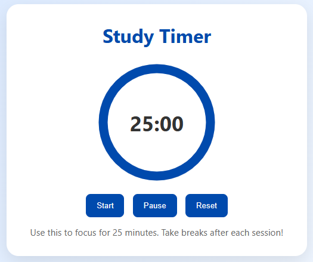

# ⏳ Study Timer – Boost Your Focus & Productivity!

Welcome to the **Study Timer** – a beautifully designed, distraction-free countdown timer built with **HTML, CSS, and JavaScript**. This lightweight project is ideal for students, coders, and anyone looking to enhance their focus using timed study sessions.

---

## 🔥 Features

- 🧠 Simple and minimal UI for better concentration
- ⏰ Customizable time settings
- 🔔 Cute and professional alert popup when time is up
- 📱 Fully responsive design for mobile and desktop
- 🎨 Clean and modern CSS styling
- 🧪 Tested & perfect for YouTube tutorials, personal use, or as a project to improve your JS skills

---

## 🚀 Live Demo

👉 Watch the full tutorial on YouTube: [Build Your Own Study Timer in 4 Minutes](https://www.youtube.com/@devdeeks)

---

## 📁 Project Structure

study-timer/
│
├── index.html # Main HTML file
├── style.css # Stylish and professional CSS
├── script.js # Functional JavaScript logic
└── screenshot.png # Screenshot of the project

---

## 🛠️ How to Use

1. Clone this repository
2. Open the folder and run index.html in any browser.
3. Set your desired time and start your focused study session!

💡 Customize It
1. Change alert sound 🎵
2. Add background themes or motivational quotes 🌈
3. Add Pomodoro-style breaks 🍅

📜 License
This project is licensed under the MIT License – feel free to use, modify, and share!

💬 Let's Connect
✨ If you liked this project, please consider giving a ⭐️ on GitHub and subscribing to my channel!
📧 [Contact me on YouTube](https://www.youtube.com/@devdeeks)
